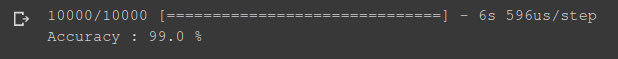

# handwritten-digit-classification---deep-learning
handwritten digit classification using Convolutional Neural Network (CNN) --deep learning

[](https://github.com/kanishksh4rma/Parkinson-Disease-Prediction-in-Early-Stages) [](https://github.com/kanishksh4rma/Parkinson-Disease-Prediction-in-Early-Stages)
 
 ---

## **Installation**

### Copy and Run this in terminal: 

```
pip3 install keras pandas matplotlib

git clone https://github.com/kanishksh4rma/handwritten-digit-classification---deep-learning.git
```


---

### Libraries used : 

```
  * pandas
  * matplotlib
  * sklearn
  * keras
```
---

## Algorithms Used

The Algorithms used are : 

	* Convolutional Neural Network (CNN)

---

# ***Accuracy*** : 


---

> Developed by: [Kanishk Sharma](github.com/kanishksh4rma) 

[](https://github.com/kanishksh4rma/Parkinson-Disease-Prediction-in-Early-Stages)

